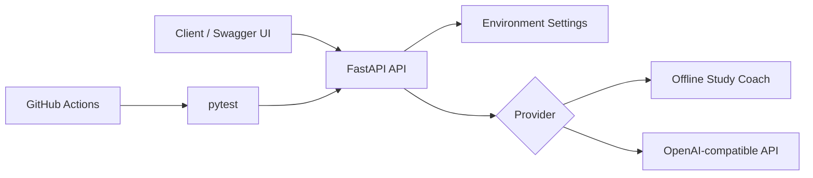

<div align="center">

# LLM Full-Stack Journey 🚀

**从学习笔记到可运行、可测试、可迭代的 AI 应用。**


[](https://github.com/lizhuofan-curry/LLM-FullStack-Journey/actions/workflows/ci.yml)


</div>

这个仓库记录我学习 Python、FastAPI、数据库与 LLM 应用开发的过程。除了原有课程笔记，仓库现在提供一个独立的 **AI Study Coach API**：默认无需 API Key 即可运行，也可以切换到兼容 Chat Completions 接口的真实模型服务。

## What You Can Run

| Endpoint | Method | Purpose |
| --- | --- | --- |
| `/` | `GET` | 服务入口与文档链接 |
| `/health` | `GET` | 健康检查和当前 Provider |
| `/api/chat` | `POST` | 获取 AI 工程学习建议 |
| `/docs` | `GET` | FastAPI 自动生成的交互式文档 |

默认的 `demo` Provider 是确定性的离线实现，方便任何人直接体验、运行测试和理解代码结构。设置环境变量后，可切换到 OpenAI-compatible Provider。

## Quick Start

```powershell
python -m venv .venv
.\.venv\Scripts\Activate.ps1
python -m pip install -e ".[dev]"
uvicorn app.main:app --reload
```

打开 <http://127.0.0.1:8000/docs>，或者直接请求：

```bash
curl -X POST http://127.0.0.1:8000/api/chat \
  -H "Content-Type: application/json" \
  -d '{"message":"如何开始一个 FastAPI 项目？","context":["需要自动化测试"]}'
```

示例响应：

```json
{
  "reply": "学习建议：先实现健康检查和请求模型，再补充业务路由、异常处理与测试。\n已参考 1 条补充背景。",
  "provider": "demo",
  "model": "study-coach-v1"
}
```

## Connect a Real Model

复制 `.env.example` 为 `.env`，并填写兼容 Chat Completions 接口的服务信息：

```dotenv
LLM_PROVIDER=openai-compatible
LLM_API_KEY=replace-me
LLM_BASE_URL=https://api.openai.com/v1
LLM_MODEL=gpt-4o-mini
```

`.env` 已被 Git 忽略，请勿提交真实密钥。

## Architecture



```text
.
├── app/
│   ├── main.py             # API routes and error mapping
│   ├── config.py           # Environment-backed settings
│   ├── schemas.py          # Pydantic request/response models
│   └── services/chat.py    # Provider abstraction and implementations
├── tests/test_api.py       # API contract tests
├── .github/workflows/ci.yml
├── .env.example
└── pyproject.toml
```

## Quality Checks

```powershell
ruff check app tests
pytest -q
```

GitHub Actions 会在每次 Push 和 Pull Request 中运行相同的检查。

## Learning Archive

原有学习内容继续保留，作为从基础到应用的过程记录：

- [Python 核心语法](./01_Python_FastAPI/python/)
- [FastAPI 学习示例](./01_Python_FastAPI/FastAPI/)
- [MySQL 学习与练习](./数据库/MYSQL/)

## Roadmap

- [x] Python、FastAPI 与数据库基础
- [x] 可运行的 FastAPI AI 应用骨架
- [x] 离线 Provider、接口测试与 CI
- [ ] 增加多轮会话与持久化存储
- [ ] 增加 RAG 检索、引用与评估
- [ ] 使用 LangGraph 构建有状态 Agent 工作流
- [ ] 增加 Docker 与在线 Demo

## Security

- 不在仓库中提交 API Key、`.env` 或模型权重。
- CI 仅使用离线 Provider，不会调用外部模型或消耗额度。
- 外部 Provider 错误会映射为明确的 `502/503` API 响应。

---

如果这个学习路径对你有帮助，欢迎通过 Issue 交流改进建议。
